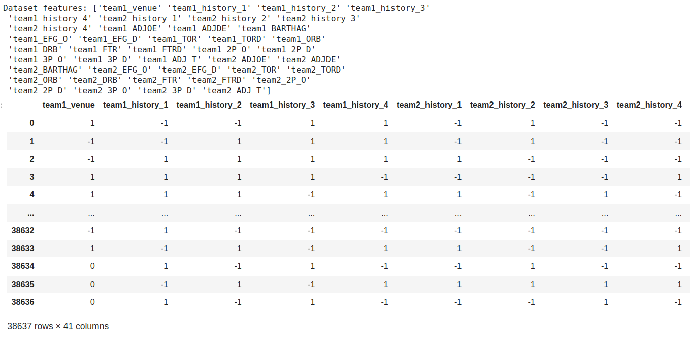
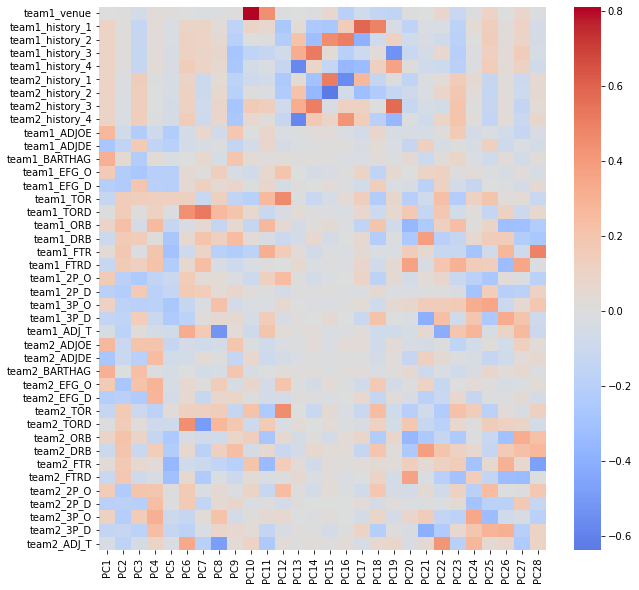
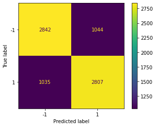
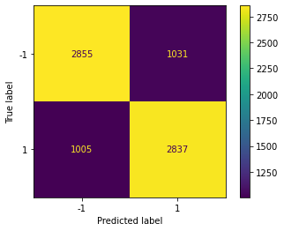

# Predicting NCAA Basketball Game Results
### Introduction
National sports, and notably college basketball, has proliferated throughout society and has garnered millions of fans throughout the world. With NCAA basketball becoming a premier form of entertainment, it becomes important to be able to predict these games for several reasons. Bunker and Thabtah [1] analyzed the proficiency of using artificial neural networks to predict outcomes of games and found the average performance of this model to be around 67.5%. Fialho et al. [2] reviewed different models such as artificial neural networks and support vector machines when applied to soccer and suggested that neural networks over the other methods due to their higher accuracy. Jain and Kaur [3] used Caret algorithm to pre-process the data and Boruta algorithm for features selection. The trained SVM then produced accuracy averaging 86%. With these studies in mind, an effective plan for developing a predictive model for NCAA basketball games can be made.
### Problem Definition
With sports betting finding immense popularity in today’s society, it becomes desirable to investigate whether machine learning techniques provide any advantages. A successful predictive model would lead to huge financial implications in a lucrative industry.
### Data Collection

The dataset we used for data collection was gathered from the College Basketball Dataset provided by Kaggle, which contained NCAA games from 2013 up until 2021. We used a Python based scraper to collect data from around 60,000 games from all 8 seasons, but to make it more efficient, we randomly selected teams in each season to collect data from. The features we are most interested in looking at are the venue the teams played at (home, away, or neutral) and the winner/loser outcome of the game. An important observation from the outcome that we want to investigate further is how a winning/loss streak can greatly impact a team’s morality and potentially their performance within the next games they play. As an additional feature, we will add the most recently played game’s outcome as part of the dataset to see its potential influence on its respective current game. For data cleaning, all rows that contained any NaN’s were removed from the dataset, and binarization techniques for feature data were used to convert home, neutral, and aways to 1, 0, and -1, and wins and losses to 1 and -1, respectively. The scraper file, implementation of binarization and data cleaning, as well as example tables of the data can be found within the GitHub and Jupyter notebook. Below shows the final cleaned dataset of features.

### Methods
To determine the outcome of a game, we will perform binary classification (win vs loss) between two teams using the input data of *tempo-free team statistics*. We are particularly interested in using *tempo-free statistics*, which are team statistics that are invariant to the tempo or the rate that a team plays at. Because different team play styles will have varying tempos, it is important to not bias against teams and the rate that they play the game. We obtained a Kaggle dataset of the tempo-free team statistics across multiple seasons. Not only are we interested in using the tempo-free statistics as features, but we are also interested in using the outcomes of a team's recently played games. We hypothesize that winning and losing streaks will have a major impact on a teams' morale and the performance for the next game. We will experiment with several different  methods:
1. Gaussian Naive Bayes: we used a Gaussian Naive Bayes model to predict the outcome of a game. We used sci-kit learn to implement Gaussian Naive Bayes.
2. Logistic Regression: we used logistic regression by applying a binary classification of wins and losses. We used sci-kit learn to implement logistic regression.
3. Support Vector Machines: we trained an SVM to separate two teams into winner and loser classes. We used sci-kit learn to implement SVM.

### Results and Discussion

We chose to build our prediction model using three supervised methods - Gaussian Naive Bayes, Logistic Regression, and Support Vector Machine (SVM). We chose these three models because they are relatively simple to implement and are computationally efficient. Additionally, we chose to use these models because they are well suited for binary classification problems, which is the type of problem we are trying to solve.

In our midterm checkpoint, we were only using team statistics from team1. However, only relying on only a single team's set of season statistics resulting in a large amount of misclassified games with our initial models. Therefore, we determined that it would be more beneficial to include both team1 and team2 tempo-free statistics as features since the difference between the two teams' statistics will provide more information about the game than the statistics of a single team. We observed approximately a 10% increase in accuracy across all models after including both teams' statistics as features.

In addition, we previously did not normalize our statistics, which negatively impacted the performance of our models since certain features were being heavily weighted when they were unnormalized. Therefore, we used scikit's StandardScaler to normalize our data before performing PCA training our models. We observed about a 2% increase of accuracy improvement after standardizing our features.

Before applying the selected models to the dataset, some preprocessing in the form of Principal Component Analysis (PCA) is performed in order to reduce the dimensions of the dataset. This will reduce the computation required during training and will provide data that is easier to work with. We use PCA to reduce the dimensions of our dataset from 41 features to 28 components, where 28 principle components was selected to retain at least 95% of the explained variance in the data. Below shows the explained variance for different number of PCA components.



Below shows the three largest components plotted against the outcomes of the games. It can be seen that although it is not possible to linearly separate the two classes using the first three components, some separation can be observed between the two classes.



To perform further analysis on the PCA components, we included a heat map of the contributed weights of each feature for all components. One thing that is interesting to note is that the first component has large positive weights associated with a predicted metric of how likely a team would beat the average D1 team, which makes sense since it is a general evaluation of how competitive a team would be. Another interesting observation is that PCA10 and PCA11 have large positive weights with if a team was playing home or away, which makes sense since home court advantage is a real phenomenon in sports.

To evaluate our models' performance, we utilized a confusion matrix and obtained their corresponding accuracy and F-1 score values, as presented below:

| Model                          | Accuracy                | F-1 Score   |
| ------------------------------ | ----------------------- |-------------|
| Gaussian Naive Bayes           | 74.8 ± 0.5%             | 74.9 ± 0.3% |
| Logistic Regression            | 75.0 ± 0.2%             | 75.1 ± 0.4% |
| Support Vector Machine         | 74.6 ± 0.3%             | 74.2 ± 0.1% |

Based on the data presented in the table, it is evident that all three models have produced somewhat comparable accuracy and F-1 scores, which indicates satisfactory performance for our specific use case. However, it should be noted that the efficacy of each model cannot be generalized, as they have their unique strengths and limitations. For instance, we have observed that Gaussian Naive Bayes and Logistic Regression are computationally efficient and straightforward to implement. On the other hand, Support Vector Machines are the most suitable option for handling non-linearly separable datasets. However, SVMs are computationally expensive and comparatively more complex than the other two models.

#### Models

**Gaussian Naive Bayes**\
Using the Gaussian Naive Bayes approach, we achieved an accuracy rate of 74.8 ± 0.5% and an F1 score of 74.9 ± 0.3%. We have attempted to tune the Gaussian Naive Bayes model by adjusting the priors, but we have observed that the model performs best when the priors the default 0.5, 0.5 values. This is because the dataset of predicting game outcomes is balanced, so the default priors are the most suitable for the dataset.

 

**Logistic Regression**\
For our logistic regression model, we saw an accuracy of 75.0 ± 0.2% when predicting the outcome of randomly sampled games. Additionally, the model showed an F1 value of 75.1 ± 0.4%. Although we performed a grid search across various hyperparameters, we observed that the highest performing model actually used the default parameters with the max iterations set to 1000.

 

**Support Vector Machines**\
As for SVM, our model has an accuracy of 74.6 ± 0.3% and an F1 score of 74.2 ± 0.1%. This is surprising since that SVM is the most suitable option for handling non-linearly separable datasets. We have attempted to tune the SVM model through pipelining and bagging, but we have observed that the default model performs the best.

 

### Conclusion
Initially at the midterm checkpoint, the team saw an accuracy of around 63%. Now that we have added the set of team2 tempo-free statistics and normalized our data, we have observed a dramatic increase in accuracy of about 75%, with our highest performing model being Logistic Regression's accuracy of 75.0%. Overall, we have found that the simple and computationally efficient discriminitive models performed the best. However, we have observed that the accuracy of the models is relatively consistent across all three models, which indicates that the models are not exhibiting any bias and are performing consistently across all selected features. We were initially surprised to note that SVM did not perform as strongly as we had hypothesized, since SVM is the most suitable option for handling non-linearly separable datasets. However, this seems to make sense since the dataset is *relatively* linearly separable, as shown in the PCA visualization. In the future, we would like to explore other models such as Random Forests and Neural Networks to see if we can achieve a higher accuracy. Additionally, we would like to explore other methods of preprocessing the data, such as using a different number of PCA components or using a different method of dimensionality reduction.

### Proposed Timeline
[Link to Gantt Chart](https://www.dropbox.com/s/cof5fgvn9mwrexg/GanttChart.xlsx?dl=0)

[View in Repo](GanttChart.xlsx)
### Contribution Table

| Contributor                    | Task                                                                     |
|--------------------------------|--------------------------------------------------------------------------|
| Alvin Fabrio                   | Managed team logistics, created Gantt chart, and assisted members in performing their tasks. Prepared the presentation and one of the members that performed it. Contributed to the midterm report by conducting analysis on the output of the utilized models and generated the results and discussions. Performed hyperparameter tuning and improving performance for SVM.                |
| Phillip Kim                    | Wrote the introduction/background and problem definition. Researched articles to provide details about the background of the NCAA and statistics of already existing predictive models for the sport. Contributed to the midterm report by writing the results/discussions and generating the confusion matrices. Performed deeper analysis of how to improve the models and dataset using PCA.                              |
| Jerred Chen                    | Provided the techniques to train our model and methods for data classification. Also went in depth about the details of the potential results, discussing how we will be able to measure the accuracy of our model. Contributed to the midterm report by writing the jupyter notebook to train the 3 different models. Performed feature engineering to improve the dataset and subsequently model performances.                 |
| Jun Yi Chuah                   | Researched many of the articles used in the background and problem definition. Also assisted with writing the potential results and discussion with the researched articles. Contributed to the midterm report by creating the PCA visualization and embedding it in the report. Also helped write portions of the results/discussion. Improved the performance of logistic regression and created a heatmap of the PCA loadings.                                             |
| Alexa Hanna                    | Created the contribution table and powerpoint presentation. Filled in each member’s contribution within the table and also filled in most of the information within the presentation. Also one of the presenters for the proposal video. Contributed to the midterm report by assisting with data collection and writing the data collection section. Created the presentation and video for the final report.

### References
[1] R. P. Bunker and F. Thabtah, “A machine learning framework for sport result prediction,” Applied Computing and Informatics, vol. 15, no. 1, pp. 27–33, Jan. 2019, doi: https://doi.org/10.1016/j.aci.2017.09.005.

[2] G. Fialho, A. Manhães, and J. P. Teixeira, “Predicting sports results with Artificial Intelligence – A proposal framework for soccer games,” Procedia Computer Science, vol. 164, pp. 131–136, 2019. 

[3] S. Jain and H. Kaur, "Machine learning approaches to predict basketball game outcome," 2017 3rd International Conference on Advances in Computing,Communication & Automation (ICACCA) (Fall), Dehradun, India, 2017, pp. 1-7, doi: 10.1109/ICACCAF.2017.8344688.
